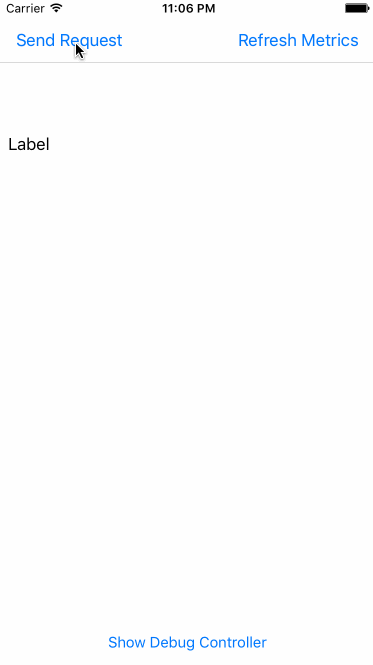

# URLSessionMetrics

[](https://travis-ci.org/dmiedema/URLSessionMetrics)
[](http://cocoapods.org/pods/URLSessionMetrics)
[](http://cocoapods.org/pods/URLSessionMetrics)
[](http://cocoapods.org/pods/URLSessionMetrics)

Simple drop in and go. Displaying and viewing the request metrics is already handled



## Example

To run the example project, clone the repo, and run `pod install` from the Example directory first.

## Requirements

- Swift 3.

For Swift 4 see the `Swift4` branch

## Installation

URLSessionMetrics is available through [CocoaPods](http://cocoapods.org). To install
it, simply add the following line to your Podfile:

```ruby
pod "URLSessionMetrics"
```

OR

Drag `URLSessionMetrics/Classes` folder into your project and add files.

## Setup

Make sure your Network calls library conforms to the `URLSessionTaskDelegate`.

Inform the shared `MetricsManager` that metrics were collected
```swift
extension RequestManager: URLSessionTaskDelegate {
	public func urlSession(_ session: URLSession, task: URLSessionTask, didFinishCollecting metrics: URLSessionTaskMetrics) {
		MetricsManager.shared.add(entry: metrics)
	}
}

```

```objc
@interface NetworkingManager() 
#ifdef __IPHONE_10_0
<NSURLSessionTaskDelegate>
#endif
... [other code] ...
@end

@implementation NetworkingManager
...
#ifdef __IPHONE_10_0
- (void)URLSession:(NSURLSession *)session task:(NSURLSessionTask *)task didFinishCollectingMetrics:(NSURLSessionTaskMetrics *)metrics {
    [[MetricsManager shared] addWithEntry:metrics];
}
#endif
```

## Author

dmiedema, danielmiedema+github@me.com

## License

URLSessionMetrics is available under the MIT license. See the LICENSE file for more info.
